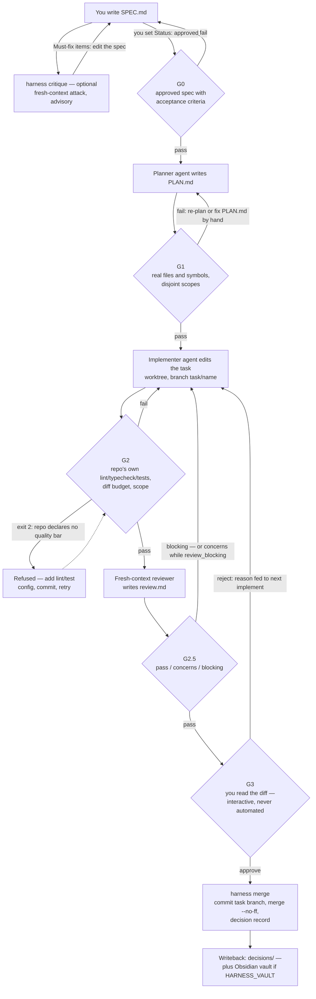
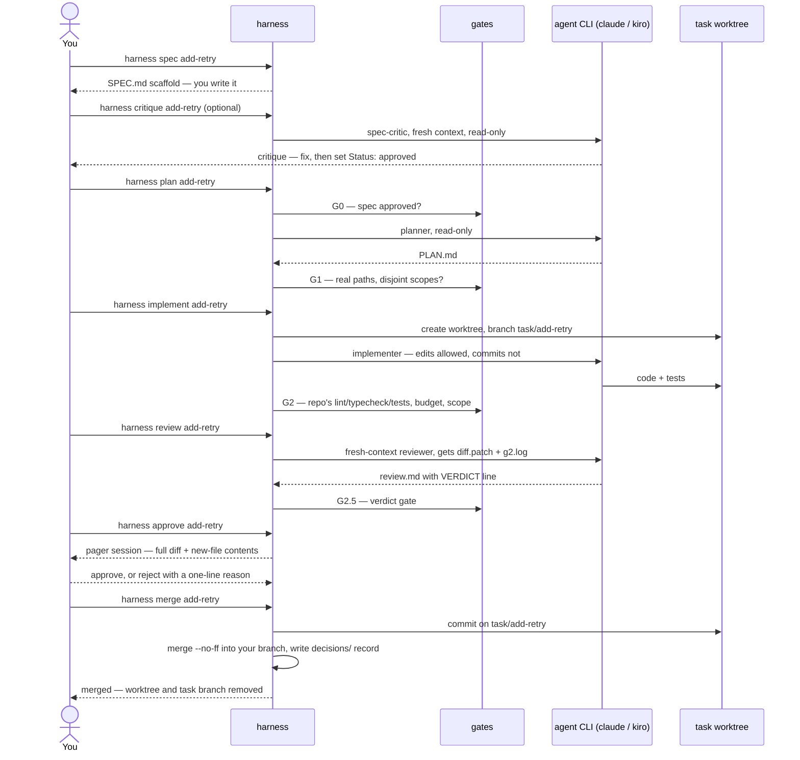

# harness

A thin terminal harness that drives systematic software development by
orchestrating agent CLIs through **mechanical quality gates**. A convention
plus a small CLI, not an application. See [HARNESS-PLAN.md](HARNESS-PLAN.md)
for the full design — and read **[PHILOSOPHY.md](PHILOSOPHY.md)** before your
first task: it explains why the harness will refuse you and how to respond
effectively when it does. **[TROUBLESHOOTING.md](TROUBLESHOOTING.md)** is the
symptom → fix reference for when something goes wrong.

> **Gates, not virtue.** An agent cannot advance a phase; only a passing gate
> (exit 0) can.

## Pipeline

```
SPEC ──G0──▶ PLAN ──G1──▶ IMPLEMENT ──G2──▶ REVIEW ──G2.5──▶ HUMAN ──G3──▶ MERGE ──▶ WRITEBACK
```

| Gate | Checks |
|---|---|
| pre-G0 | *(optional)* `harness critique`: fresh-context, read-only agent attacks the draft spec — untestable criteria, ambiguity, conflicts with the repo. Advisory; never a gate |
| G0 | SPEC.md exists, has acceptance criteria, human set `Status: approved` |
| G1 | Plan references only real files/symbols; fan-out scopes disjoint |
| G2 | Repo's **own** lint/typecheck/tests pass; diff budget; scope respected. Refuses (exit 2) repos with no toolchain |
| G2.5 | Fresh-context, read-only reviewer verdict: `pass` / `concerns` / `blocking` |
| G3 | A human reads the diff. Interactive only — never automated |

### Logical flow

The one-liner above is the happy path. The real shape includes the failure
loops — every fail routes back to a phase, never past a gate:



### One task, end to end

Who does what — you, the CLI, the gates, the agent runtime, and the task's
sandbox worktree. Every gate answers with an exit code (0 pass, 1 fail,
2 refused); a non-zero stops the command right there:



## Quickstart

```sh
export PATH="$PATH:/path/to/harness/bin"
cp templates/PRINCIPLES.md ~/.harness/PRINCIPLES.md   # once, globally

cd yourrepo                    # must be git, must have its own lint/test config
harness init                   # .tasks/, decisions/, AGENTS.md, .harness.toml
harness spec add-retry         # scaffold .tasks/add-retry/SPEC.md
$EDITOR .tasks/add-retry/SPEC.md   # write it — the spec stays yours
harness critique add-retry     # optional: fresh-context agent attacks the draft
$EDITOR .tasks/add-retry/SPEC.md   # fix what it caught; set "Status: approved"

harness plan add-retry         # G0 → planner agent → PLAN.md → G1
harness implement add-retry    # implementer agent → G2 (lint/tests/scope/budget)
harness review add-retry       # fresh-context reviewer → review.md → G2.5
harness approve add-retry      # G3: you read the diff
harness merge add-retry        # commit + decisions/ record
```

## Commands

Pipeline, in order:

| Command | What it does |
|---|---|
| `harness init [dir]` | set up `.tasks/`, `decisions/`, AGENTS.md, `.harness.toml` |
| `harness spec <task>` | scaffold `.tasks/<task>/SPEC.md` — then you write it and approve it |
| `harness critique <task>` | fresh-context agent attacks your draft spec (advisory, pre-G0) |
| `harness split <task>` | stage a bundled spec as N draft specs (clerical; you approve each) |
| `harness plan <task>` | G0 → planner agent writes PLAN.md → G1 |
| `harness implement <task>` | implementer agent edits the task worktree → G2 |
| `harness review <task>` | fresh-context reviewer writes review.md → G2.5 |
| `harness approve <task>` | G3 — you read the diff (interactive, never automated) |
| `harness merge <task>` | commit + decision record + writeback (requires G3 approval) |

Around the pipeline:

| Command | What it does |
|---|---|
| `harness status <task>` | show gate progress |
| `harness gate <g> <task>` | run one gate manually (`g0`, `g1`, `g2`, `g2.5`, `g3`) |
| `harness diff <task>` | show the task's changes from its own tree (no branch checkout) |
| `harness adopt <task>` | move work done in main into the task's worktree — explore in main, deliver isolated |
| `harness calibrate` | reviewer verdicts vs your G3 decisions (TPR/TNR confusion matrix) |
| `harness stats` | cost, duration, gate failure rates across tasks |
| `harness doctor` | preflight: git, toolchain, adapter, dependencies |
| `harness loc` | current repo's product/test/doc line counts vs the budget |
| `harness version` | version + commit |

Re-running a phase invalidates its gate and everything downstream.

## Adapters

`HARNESS_ADAPTER` selects the agent CLI (default `claude`; also `kiro`).
Roles keep their permissions on every runtime: the Kiro adapter generates
custom agents in `~/.kiro/agents/` whose `tools`/`toolsSettings` enforce
read-only planner/reviewer and a no-commit implementer.

```sh
HARNESS_ADAPTER=kiro harness implement add-retry
```

Cross-CLI review is one config line — `reviewer_model = "adapter/model"`
(e.g. `"claude/claude-opus-4-8"` while implementing with Kiro) routes G2.5's
reviewer through a different CLI and model than the implementer.

## Reviewer calibration

An LLM judge is trusted only once validated against human labels. Every G2.5
verdict and every G3 decision is logged to the task's `events.jsonl`, and

```sh
harness calibrate
```

pairs them chronologically and prints the confusion matrix with TPR (≥ 0.80)
and TNR (≥ 0.70) targets. If the reviewer isn't clearing those after ~20
labeled pairs, fix `roles/reviewer.md` or change `reviewer_model` — don't
trust the gate.

`harness stats` aggregates every task's `events.jsonl`: agent cost and time,
and gate failure rates by gate — the tool's own UX health metric.

When `harness critique` flags a bundled spec, `harness split <task>` stages
the partition as **draft** specs (your words reorganized, never authored;
`Status: draft` forced mechanically) — you edit and approve each before
anything proceeds.

## Layout

```
bin/harness        CLI dispatcher + pipeline sequencing
lib/common.sh      config, plan parsing helpers
gates/             one executable per gate, exit 0/1 (2 = refused)
adapters/          run(role, task_dir, workdir); claude.sh for now
roles/             planner / implementer / reviewer — prompt + permissions, nothing more
templates/         SPEC.md, AGENTS.md, PRINCIPLES.md, .harness.toml
```

Per-repo config is [4 lines of TOML](templates/harness.toml). No other
configuration exists. `harness loc` checks the ~1,700-line budget (v1 was
~1,500; raised once for v2 scope — HARNESS-PLAN.md §9.6).

## Development

The harness holds itself to its own bar: `make lint` (shellcheck) and
`make test` (125-assertion black-box regression suite in `tests/`, stub
adapters, no network) — the exact commands G2 discovers in this repo. CI
runs both on Ubuntu and macOS (bash 3.2, the compatibility floor). Run
`harness doctor` to preflight a machine. The suite treats the CLI as a
black box on purpose: it is the conformance spec for any future port
(HARNESS-PLAN.md §10 — the language stays shell until a written trigger
fires).

## Build order status

| Step | Deliverable | Status |
|---|---|---|
| 1 | Layout, gates G0–G3, Claude adapter, single-task flow | ✅ built |
| 2 | `ctx` tooling (map/sym/grep/doc) + steering rule | — |
| 3 | Worktree + container isolation | ✅ worktree per task (`<repo>-worktrees/<task>`, branch `task/<name>`); containers pending |
| 4 | fan-out: parallel implementers per subtask worktree, join, combine | ✅ portable `&`+`wait`; zmx attach pending |
| 5 | Second adapter + cross-model review | ✅ kiro.sh + `reviewer_model = "adapter/model"` (Copilot pending) |
| 6 | Writeback to Obsidian vault (decisions/ writeback already in `merge`) | ✅ set `HARNESS_VAULT=/path/to/vault` |
